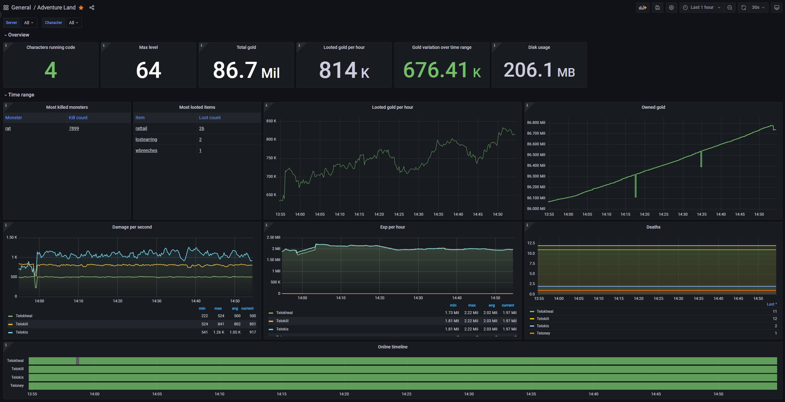
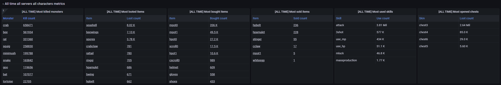
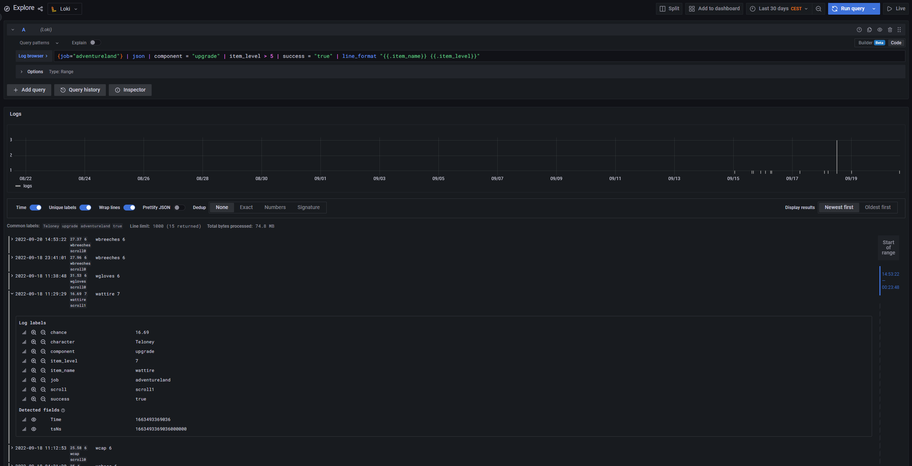

# Adventure Land monitoring toolkit

## Introduction

I use the [`docker-compose.yml`](backend/docker-compose.yml) to deploy:
- `VictoriaMetrics` which stores the raw metrics.
- `Grafana`, which I use to create and manage my dashboard.
- `Loki` which I use to store my logs (I then use Grafana to look at/query them) --> This is optional but can be nice to have.

Then everything is handled in pure JS code where I defined several custom metrics that I then update. And I will push the state of my metrics every 15s from each character independently.

## Overview

Inside `backend` you will find the `docker-compose` and its requirements defining the services that need to be started:
* [`docker-compose.yml`](backend/docker-compose.yml) will run `VictoriaMetrics`, `Grafana` and `Loki`. It will also mount the folders located in `data` which contain configuration files.
* `data` basically contains configuration and default setup for the tools.
  * [`grafana/dashboards`](backend/data/grafana/dashboards/adventureland.json) contains my current adventureland dashboard.
  * [`grafana/datasources`](backend/data/grafana/datasources/datasource.yml) tells Grafana about `VictoriaMetrics` and `Loki` by default.
  * [`loki/config.yml`](backend/data/loki/config.yml) configures `Loki` with sane local defaults. Be careful, it will keep logs for 10 years so make sure that's ok with your setup!
  * [`victoriametrics/prometheus.yml`](backend/data/victoriametrics/prometheus.yml) Configures `VictoriaMetrics` to retrieve metrics from the other services. This is currently unused but can be useful to make sure everything is working properly.

Inside `client` you will find some base js/ts files you can use to quickly get started with monitoring:
* [`prom.js`](client/prom.js) is a forked and modified version of [`prom-client`](https://github.com/siimon/prom-client). I removed a lot of superfluous stuff to ensure everything would stay light. I updated to make it work in the browser by default and removed the `Histogram` and `Summary` metrics handlers.
* [`prom.d.ts`](client/prom.d.ts) provides the typescript type definitions for the modified `prom.js`.
* [`Loki.ts`](client/Loki.ts) provides a `Loki` class and a `loki` singleton which will automatically push logs every 15s. You should provide `LOKI_POST_URL` and `LOKI_AUTH_TOKEN` or update the relevant code at the bottom of the file.
* [`metrics.ts`](client/metrics.ts) creates several default metrics and try to update them when possible. At the bottom of the file, we also push the metrics every 15s. You should provide `METRICS_POST_URL` and `METRICS_AUTH_TOKEN` or update the relevant code at the bottom of the file.

## Grafana

Grafana is used to create a nice Adventure Land dashboard with lots of useful stats and metrics.  
Here is what the provided dashboard looks like at the time of writing this. (2022/09/20):

(Click the images to open them)

<figure>
<a href="./images/dashboard_1.png">

</a>
<figcaption align = "center"><b>How things went during the past hour</b></figcaption>
</figure>

<figure>
<a href="./images/dashboard_2.png">

</a>
<figcaption align = "center"><b>Overview of everything that ever happened since setting up metrics</b></figcaption>
</figure>

As you can see in the pictures above, the top left corner gives you two dropdowns. One for `Server` and one for `Character`.  
You can use those to quickly filter the view. Select multiple characters and/or servers to have a quick overview of how things are going!  
You don't need to configure anything, the values are automatically populated based on what was found in the metrics!

In the top right corner, you can specify a time range to have a more precise view of things! Useful to check how the night went!

## Loki

Loki is used to store and query logs. Below is an example of what a query could do:

```
{job="adventureland"} | json | component = "upgrade" | item_level > 5 | success = "true" | line_format "{{.item_name}} {{.item_level}}"
```



Take a look at the [official Loki documentation](https://grafana.com/docs/loki/latest/logql/) to see what it can do.  

Be careful of how many logs you store because they will take space on your filesystem. By default, I've set Loki to store logs for ten (10) years.  
Make sure to ask me or create an issue if you have any question.

## Provided metrics

Below is a list of the currently created metrics.

* `al_character_info`: Informations regarding the character.
* `al_server_info`: Informations regarding the server.
* `al_kills_total`: How many kills my characters did.
* `al_damage_dealt_total`: How much damage my characters dealt.
* `al_damage_received_total`: How much damage my characters received.
* `al_used_skills_total`: How many skills my characters used.
* `al_deaths_total`: How many deaths my characters suffered.
* `al_opened_chests_total`: How many chests did my characters open.
* `al_looted_items_total`: How many items did my characters loot.
* `al_looted_gold_total`: How much gold did my characters loot.
* `al_bought_items_total`: How many items I bought.
* `al_spent_gold_total`: How many gold I spent.
* `al_sold_items_total`: How many items I sold.
* `al_sales_gold_total`: How many gold I gained from sales.
* `al_level_total`: How many levels my characters have.
* `al_exp_total`: How many exp points my characters have.
* `al_gold_total`: How much gold do I have.
* `al_failed_upgrades_total`: How many upgrades I failed.
* `al_success_upgrades_total`: How many upgrades I did successfully.
* `al_failed_compounds_total`: How many compounds I failed.
* `al_success_compounds_total`: How many compounds I did successfully.

## More metrics

Some metrics are defined in `metrics.ts` but not actually used. Below is an example of the way I incorporated them into my own code:

### Compound:

```ts
export const o_compound = compound;
// @ts-ignore
compound = async function compound(...args: Parameters<typeof o_compound>) {
    const item = character.items[args[0]]!;
    const res = await o_compound(...args);

    if (!args[5]) {
        if (res.success) {
            success_compounds.inc({ item: item.name, level: item.level });
        } else if (res.success === false) {
            failed_compounds.inc({ item: item.name, level: item.level });
        }
    }

    return res;
} as typeof o_compound;
```

### Upgrade:

```ts
const o_upgrade = upgrade;
// @ts-ignore
upgrade = async function upgrade(...args: Parameters<typeof o_upgrade>) {
    const item = character.items[args[0]]!;
    const res = await o_upgrade(...args);

    if (!args[3]) {
        if (res.success) {
            success_upgrades.inc({ item: item.name, level: item.level });
        } else if (res.success === false) {
            failed_upgrades.inc({ item: item.name, level: item.level });
        }
    }

    return res;
} as typeof o_upgrade;
```

### Looted chests:

```ts
// @ts-ignore
loot = safety_wrap(500, false, async (id_or_arg) => {
    if (id_or_arg && id_or_arg !== true) {
        return await parent.open_chest(id_or_arg);
    }

    let looted = 0;
    let last = null;

    for (const [id, chest] of Object.entries(parent.chests)) {
        if (id_or_arg === true) {
            last = await parent.open_chest(id);
        } else {
            last = await parent.open_chest(id);
        }

        opened_chests.labels({ skin: chest.skin }).inc();

        looted++;
        if (looted === 2) {
            break;
        }
    }

    if (!last) {
        return resolving_promise({ reason: "nothing_to_loot" });
    }

    return last;
});
```

### Used skills:

```ts
// @ts-ignore
loot = safety_wrap(500, false, async (id_or_arg) => {
    if (id_or_arg && id_or_arg !== true) {
        return await parent.open_chest(id_or_arg);
    }

    let looted = 0;
    let last = null;

    for (const [id, chest] of Object.entries(parent.chests)) {
        if (id_or_arg === true) {
            last = await parent.open_chest(id);
        } else {
            last = await parent.open_chest(id);
        }

        opened_chests.labels({ skin: chest.skin }).inc();

        looted++;
        if (looted === 2) {
            break;
        }
    }

    if (!last) {
        return resolving_promise({ reason: "nothing_to_loot" });
    }

    return last;
});
```
